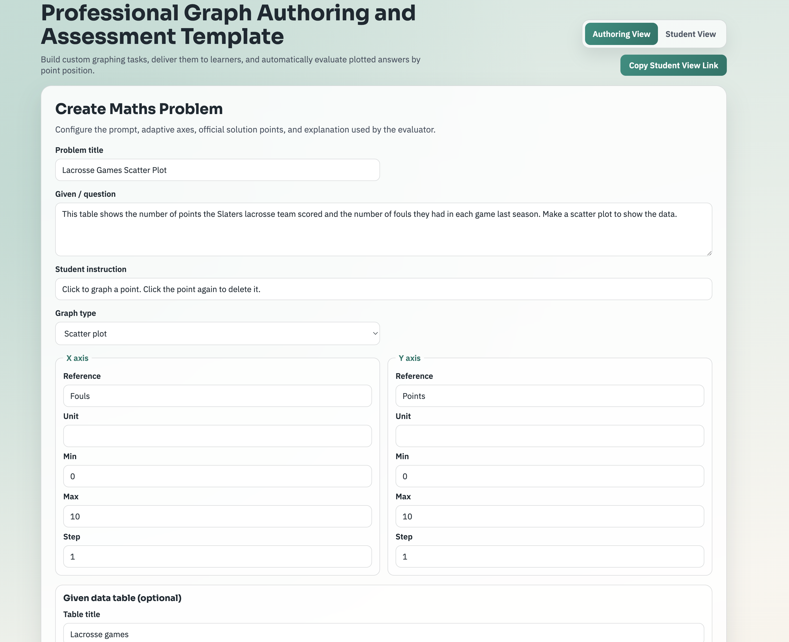
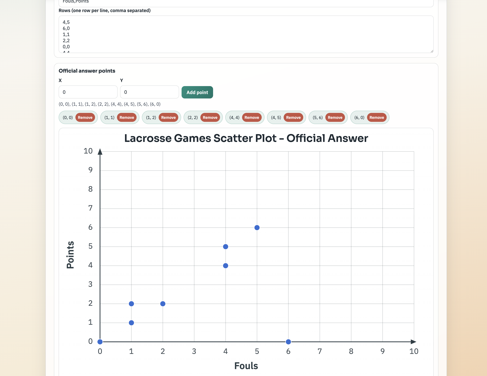
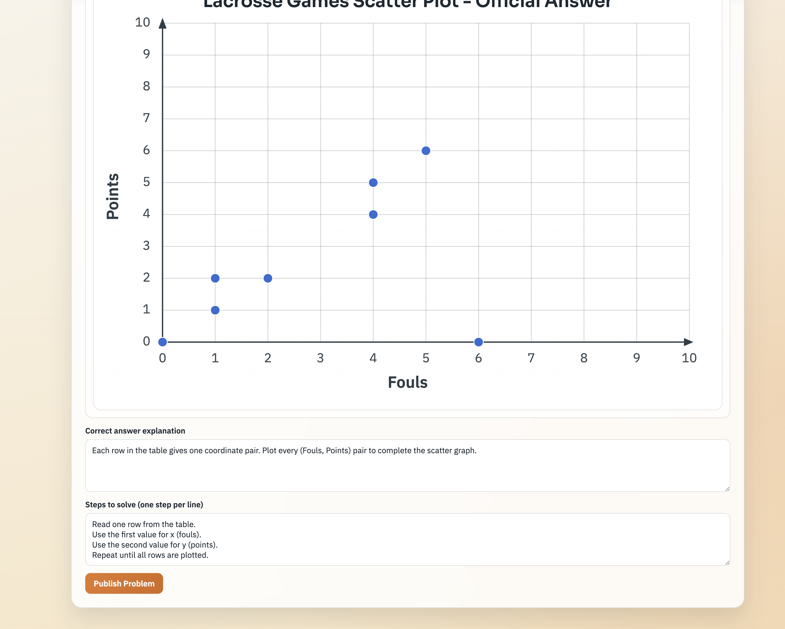
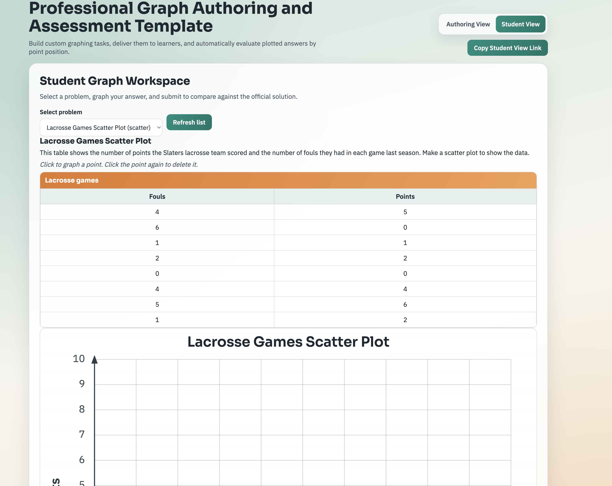
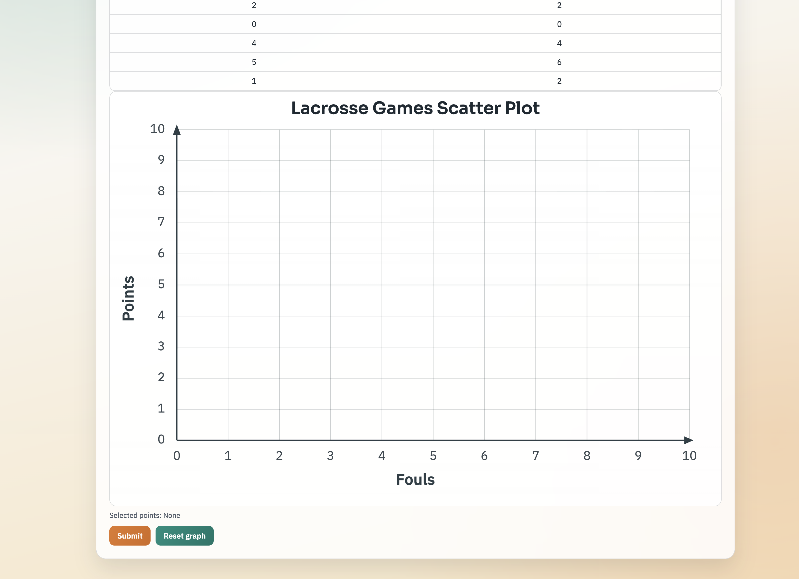
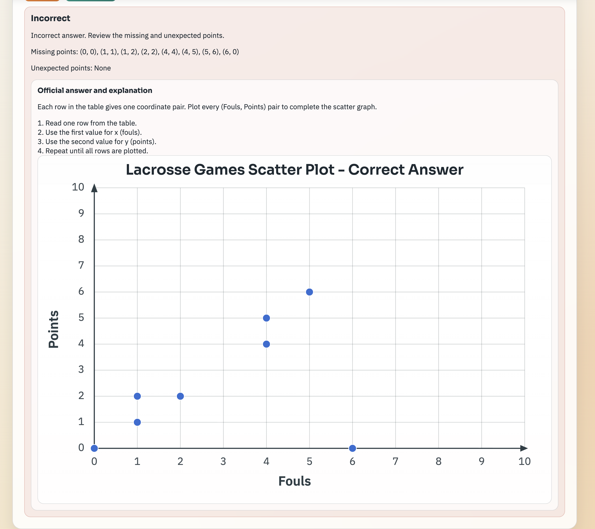

# Graph Doting 2D Template

Full-stack Graph Doting 2D app for creating and grading coordinate-graph questions.
React + TypeScript frontend and Node/Express API with validation, seeded examples, interactive plotting, and automatic point-by-point evaluation.

## What This Delivers

- Authoring workflow for data-entry/content teams to create graphing problems.
- Adaptive axis configuration:
  - Axis references (labels)
  - Axis values (min, max, step)
  - Axis units
- Optional data table editor for "given" values.
- Official answer setup with:
  - Correct points
  - Step-by-step explanation
- Student workflow to solve the graph by clicking points on an interactive coordinate system.
- Automatic answer checking by comparing point positions.
- Clear result response:
  - `Correct` when points match
  - `Incorrect` when points differ
  - Full official answer and explanation shown when incorrect

## Tech Stack

- Frontend: React + TypeScript + Vite
- Backend: Node.js + Express + TypeScript + Zod validation

## Project Structure

- `client/` React application (author + student UI)
- `server/` Express API (problem management + evaluation logic)

## API Overview

- `GET /api/health`
- `GET /api/problems` (list seeded + created problems)
- `GET /api/problems/:id` (get one full problem)
- `POST /api/problems` (create a new problem)
- `POST /api/problems/:id/evaluate` (submit student points for grading)

## Local Run

From the project root:

```bash
npm install
npm run dev
```

Apps:

- Frontend: [http://localhost:5173](http://localhost:5173)
- Backend: [http://localhost:4000](http://localhost:4000)

## Build and Quality Checks

```bash
npm run lint
npm run build
```

## Notes

- The backend seeds two example tasks matching the sample PDF (scatter and line graph examples).
- The frontend uses `/api` proxying to the Node server for local development.


### Home Page


### Operation Form





### Results







